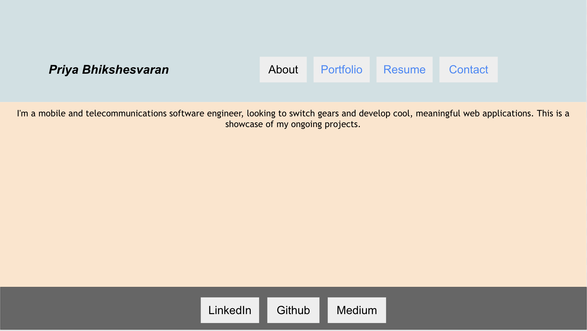
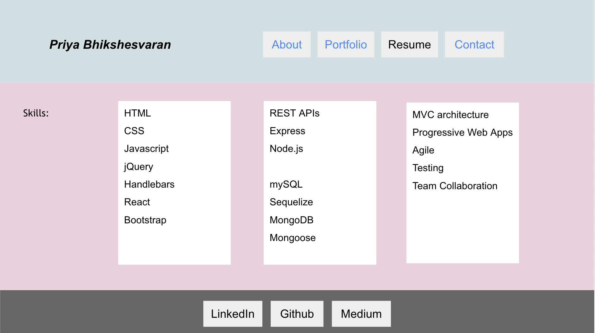
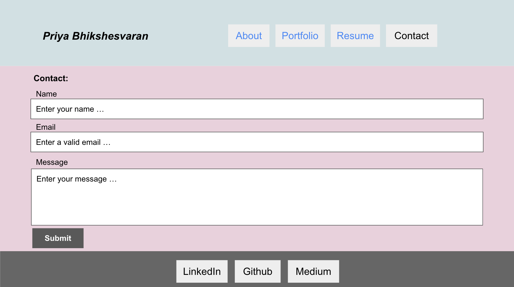

# React-Portfolio-App

## Table Of Contents
* [Description](#description)
* [Wireframe](#wireframe)
* [Technologies](#technologies)
* [References](#references)
* [Author Links](#author-links)

## Description
This is my Portfolio page made with React. Bootstrap for React is used to display the projects in the portfolio page, and the contact form. My resume can be downloaded from the Resume page.

- The deployed app is at: https://sbhikshe.github.io/react-portfolio-app/
- The github repo is: https://github.com/sbhikshe/react-portfolio-app

## Wireframe

1. Home / About 

2. Portfolio

3. Resume

4. Contact

## Technologies
- Javascript
- React
- Bootstrap for React

## References
[React](https://reactjs.org/)\
[Bootstrap for React - Grid](https://react-bootstrap.github.io/layout/grid/)\
[Bootstrap for React - Form](https://react-bootstrap.github.io/forms/overview/)\
[FontAwesome with React](https://fontawesome.com/v5/docs/web/use-with/react)

## Author Links
[GitHub](https://github.com/sbhikshe)\
[LinkedIn](https://www.linkedin.com/in/sripriya-bhikshesvaran-8520992/)

